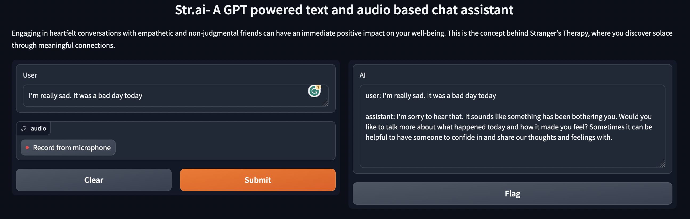

# Str.ai

`Str.ai`: <u>**S**</u>trangers at <u>**T**</u>herapeutic <u>**R**</u>escue

`Str.ai` is a `GPT powered text and audio conversational assistant` that can help you with your mental health. It is a safe space where you can talk about your feelings and emotions without the fear of being judged. It is a place where you can be yourself and talk about anything that is bothering you. It is a place where you can find a friend who will listen to you and help you feel better. You've got a friend in him!



Engaging in heartfelt conversations with empathetic and non-judgmental friends can have an immediate positive impact on your well-being. This is the concept behind `Stranger’s Therapy`, where you discover solace through meaningful connections.

Having a bad day? Go listen to [`You've Got a Friend in Me- Randy Newman`](https://www.youtube.com/watch?v=DNZUKm0ApEM) 

## How to use?
Get your own `OpenAI API key` (or help me get more OpenAI credits by `buying me a book` 👀 [here](https://www.buymeacoffee.com/kaus.mos))
```
$ git clone https://github.com/kaustubh-s1/Str.ai.git 
$ cd Str.ai

Create a virtual environment-
$ python3 -m virtualenv venv
$ source venv/bin/activate

Install dependencies-
$ pip install -r requirements.txt

Getting started-
$ python main.py
```